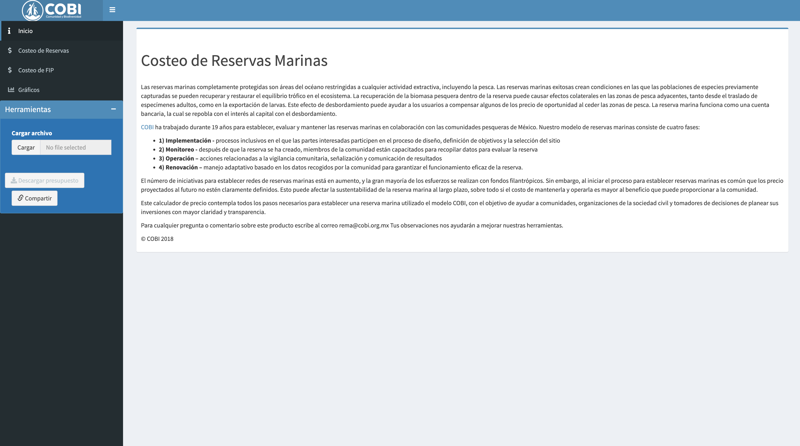
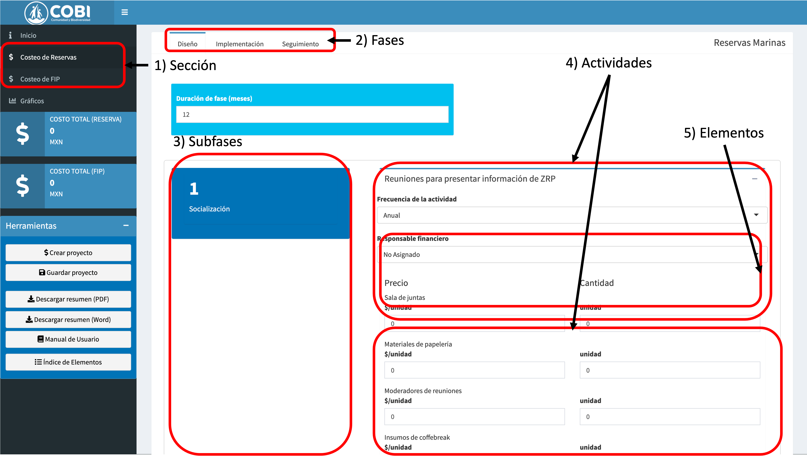
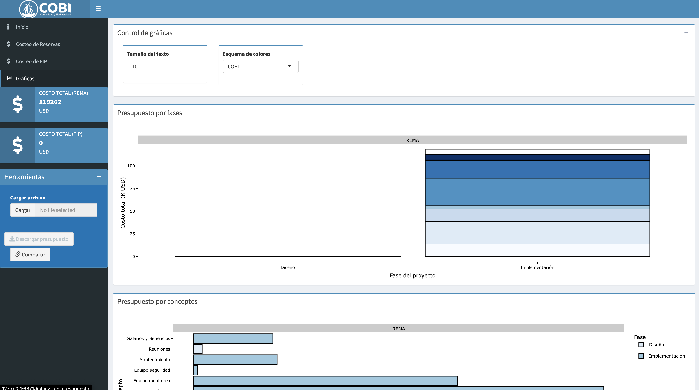

# Introducción {#intro}

El número de iniciativas para establecer redes de Reservas Marinas (REMA) y Proyectos de Mejora Pesquera (FIP) está en aumento, y la gran mayoría de los esfuerzos se realizan con fondos filantrópicos. Sin embargo, al iniciar cualquier intervención, es común que los costos proyectados al futuro no estén claramente definidos. Esto puede afectar la sustentabilidad de la intervención al largo plazo.

Esta aplicación ayuda a estimar los costos aproximados necesarios para llevar a cabo dos tipos de intervenciones: establecer una reserva marina utilizado el modelo COBI, o un proyecto de mejoramiento pesquero. Su objetivo es ayudar a comunidades, organizaciones de la sociedad civil y tomadores de decisiones de planear sus inversiones con mayor claridad y transparencia.

## Estructura de un presupuesto {#estructura}

La aplicación te permite generar un presupuesto jerárquico, definido de la siguiente manera:

- **Secciones**: Hay dos, una para Reservas Marinas (REMA) y una para Proyctos de Mejoramiento Pesquero (FIPS).

- **Fases**: Las intervenciones se dividen en tres fases: Diseño, Implementación y Seguimiento.

- **Subfase**: El número de subfases varía según el tipo de intervención y la fase, pero nos ayudan a categorizar los costos de manera más específica. La siguiente sección proporciona más detalles al respecto.

- **Actividad**: Cada subfase se compone de diferentes actividades. Por ejemplo, la subfase de Socialización para el Diseño de una reserva marina tiene únicamente una actividad: Reuniones para presentar información de ZRP. Por otro lado, la subfase de identificación y socialización en la fase de diseño de FIPs tiene cuatro actividades.

- **Elemento**: Para llevar a cabo cada actividad, es necesar con ciertos elementos. Es aquí donde pudes combinar precios y cantidades para determinar los costos de la actividad.

Por lo tanto, las secciones se dividen en fases. Las fases se dividen en subfases. Las subfases se dividen en actividades. Y las actividades se dividen en elementos.

## Interfaz de Usuario

### Barra lateral

La interfaz de usuario está diseñada para reflejar las estructura del presupuesto. Al entrar a la aplicación, lo primero que verás es una pantalla (Fig. \@ref(fig:landing-page)). El lado izquierdo muestra el panel de control y navgación. El panel te permite navegar a través de las diferentes secciones de la aplicación. La sección predeterminada es la sección de "Inicio", donde se encuentra un pequeño resumen de la aplicación, así como enlances a este manual. También están disponibles las dos secciones que identifican el tipo de intervención ("Costeo de Reservas" y "Costeo de FIP"), y la sección para visualizar el presupuesto ("Gráficos"). Finalmente, observarás la zona de herramientas disponibles, como cargar un presupuesto anterior, descargar el presupuesto de la sesión, o compartir el estado de tu sesión con alguien más.

```{r landing-page, echo = FALSE, fig.cap = "Página de bienvenida en la aplicación web."}

```

### Área de trabajo

Del lado derecho observarás el área de trabajo principal. Si estás trabajando en el llenado de un presupuesto, esta sección te mostrará los diferentes campos para que puedas ingresar los valores o explorar el presupuesto. Exploremos más a detalle cada una de estas.

La figura \@ref(fig:filling-page) muestra el estado de la aplicación cuando el usuario ha seleccionado "Costeo de Reservas" en el menú lateral. En la zona superior del área de trabajo principal podrás observar tres pestañas con los nombres de "Diseño", "Implementación", y "Seguimiento", stas son las tres fases descritas en sección \@ref(estructura). La pestaña "Implementación" está seleccionada, indicado por la barra azul sobre su nombre. En este punto, la aplicación te muestra una ventana titulada "Duración de la fase" en la que especificaremos la duración del a fase de diseño de las reservas marinas.

```{r filling-page, echo = FALSE, fig.cap = "Página de llenado de datos en la aplicación web."}

```

La fase de diseño de reservas marinas se subdivide en cuatro subfases, indicadas por los bloques azules del lado izquierdo. En este caso, el diseño de una reserva marina requiere de Socialización, Definicion de Objetivos, Elaboración de un Estudio Técnico Justificativo, y "Otros" (otros costos que el usuario puede incluir). Como dijimos en la sección \@ref(estructura), las subfases se dividen en actividades. Por ejemplo, la subfase de socialización cuenta con una única actividad: "Reuniones para presentar información de ZRP". Al hacer "click" en el signo de **+** a la derecha del título de la actividad, la aplicación despliega la lista de elementos a costear (Fig. \@ref(fig:elements)), así como la frecuencia de la actividad. Aprenderemos más sobre el llenado de un presupuesto en el capítylo \@ref(llenado).

```{r elements, echo = FALSE, fig.cap = "Elementos para la actividad de 'Reuniones para presentar información de ZRP'."}
knitr::include_graphics("images/Screen Shot 2022-07-25 at 3.08.10 PM.png")
```

La figura \@ref(fig:viewing-page) muestra el último área de trabajo, donde podrás visualizar el presupuesto. Además, contiene una nueva característica de esta versión de la aplicación: Te permite dividir el presupuesto entre diferentes actores, y anticipar el monto de sus contribuciones. Aprenderemos más a detalle sobre esta sección en el capítulo \@ref(explorar).

```{r viewing-page, echo = FALSE, fig.cap = "Página de exploración de presupuesto en la aplicación web."}

```


