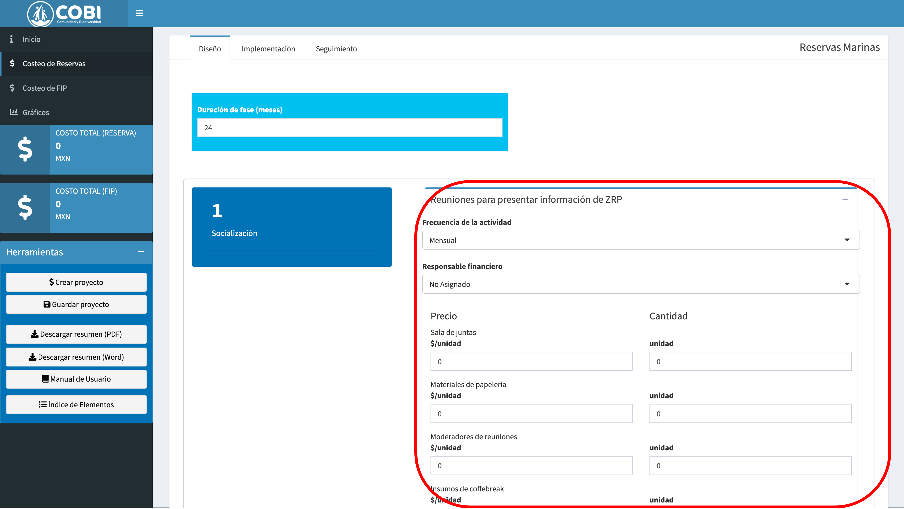
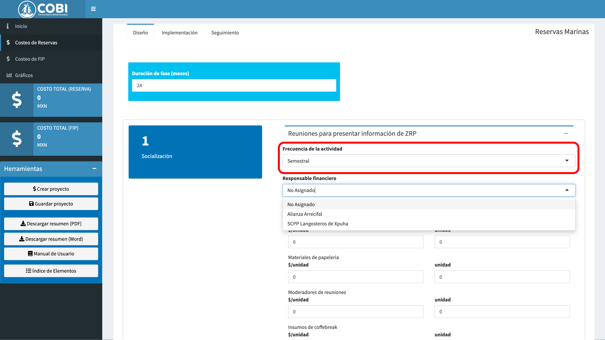
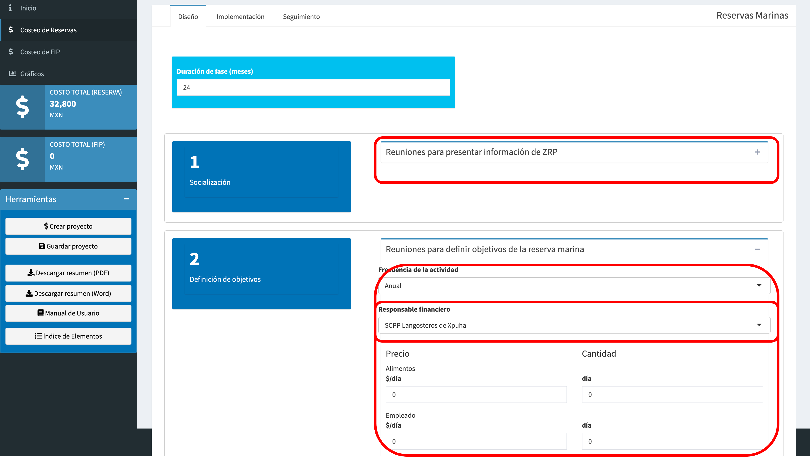
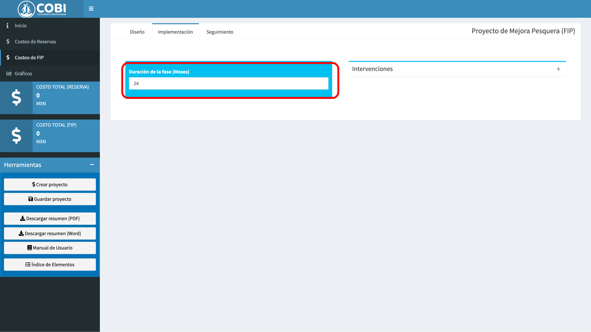

# Llenado de datos {#llenado}

En este capítulo exploramos la interfaz para el llenado de datos. Recuerda que el presupuesto sigue una regla de jerarquías descrita en la sección \@ref(estructura). El primer ejercicio se enfocará en la fase de diseño de reservas marinas. El segundo ejemplo se enfocará en la fase de implementación de un FIP. En ambos casos, utiizaremos un recuadro rojos obre las capturas de pantall para resaltar el módulo en la que estamos trabajando.

## Ejemplo de REMA {#rema}

**Paso 1 - ** Selecciona la pestaña de "Costeo de Reservas" (Fig. \@ref(fig:rem-dis-1)). Auomáticamente, la app te muestra la fase de diseño (primer pestaña del área de trabajo).

```{r rem-dis-1, echo = F, fig.cap = "Interfaz de usuario con la sección de Costeo de Reservas seleccionada"}
knitr::include_graphics("images/rema_dis_1.png")
```

**Paso 2 - ** Actualiza la duración de la fase de diseño a 2 años en el recuadro azul sobre las cuatro subfases (Fig \@ref(fig:rem-dis-2)).

```{r rem-dis-2, echo = F, fig.cap = "Modificación de la duración de fase."}
knitr::include_graphics("images/rema_dis_2.png")
```

**Paso - 3 ** Para llenar la subfase de Socialización, haz click en el simbolo de **+** en la esquina superior derecha cada actividad. Esto te mostrará todos los elementos que corresponden a esta actividad (Fig \@ref(fig:rem-dis-3)).

```{r rem-dis-3, echo = F, fig.cap = "Despliegue de una actividad."}

```

**Paso 4 - ** Selecciona la frecuencia de las reuniones. En este caso la frecuencia es semestral, pes habrá dos reuniones al año a lo largo de dos años de diseño (Fig \@ref(fig:rem-dis-4)).

```{r rem-dis-4, echo = F, fig.cap = "Frecuencia de la actividad."}

```

**Paso 5 - ** Ingresa los costos y cantidades de cada elemento. En este ejemplo la reunión semestral requiere de **una** sala de juntas que **cuesta \$1,500** (Fig \@ref(fig:rema-dis-5)). En el panel izquierdo podrás ver las actualizaciones a costos en tiempo real. En este caso, el costo hasta el momento es de \$6,000 pesos, pues 1 sala de juntas de 1,500 que se usa 2 veces al año durante 2 años = $1500 \times 1 \times 2 \times 2 = 6,000$.

```{r rem-dis-5, echo = F, fig.cap = "Llenado de datos y actualización del presupuesto."}
knitr::include_graphics("images/rema_dis_5.png")
```

**Paso 6 - ** Continua llenando los datos de la actividad, incluyendo los costos y cantidades de todos los elementos relevantes (Fig \@ref(fig:rem-dis-6)). En este caso, necesitaremos \$200 en materiales de papelería y 2 moderadores que cobrarán \$3,000 por reunión cada uno. También incluimos los insumos de coffee break, estimados en \$500 por reunión.

```{r rem-dis-6, echo = F, fig.cap = "Termina de llenar la activiad"}

```
**Paso 7 - ** Una vez hayas terminado con la actividad, ha click en el signo **-** para colapsar el formato de entrada y repite los pasos 3 - 6 para llenar las siguientes actividades (Fig \@ref(fig:rem-dis-7)). Observa cómo la actividad de reuniones está colapsada, mientras que la actividad de reunión para definir objetivos ahora está disponible.

```{r rem-dis-7, echo = F, fig.cap = ""}

```

Esto concluye la breve introducción para el llenado de un presupuesto para REMA. En un ejercicio real, probablemente necesites iterar más entre fases, subfases y actividades. En cualquier momento puedes navegar a otras secciones, por ejemplo para explorar y visualizar el presupuesto, descrito a detalle en el capítulo \@ref(explorar).


## Ejemplo de FIP {#fip}

Supongamos que ya haz cubierto la fase de diseño para un FIP. El siguiente pso es la fase de implementación, donde se selecciona y plana el tipo de intervenciones.

**Paso 1 - ** Selecciona la sección de "Costeo de FIP" en la barra lateral (Fig \@ref(fig:fip-imp-1)).

```{r fip-imp-1, echo = F, fig.cap = "Selecciona la sección."}
knitr::include_graphics("images/fip-imp-1.png")
```

**Paso 2 - ** En el área de trabajo de FIP, selecciona la pestaña de "Implementación" en la parte superior de la pantalla. (Fig \@ref(fig:fip-imp-2)).

```{r fip-imp-2, echo = F, fig.cap = "Selecciona la fase"}
knitr::include_graphics("images/fip-imp-2.png")
```

**Paso 2 - ** Ingresa la duración de la fase, en este caso de 2 años (Fig \@ref(fig:fip-imp-3)).

```{r fip-imp-3, echo = F, fig.cap = "Selecciona la duración de la fase."}

```

**Paso 4 - ** Un FIP puede tener diferentes intervenciones. Usa el menú desplegable del lado derecho para seleccionar las intervenciones que corresponden a tu programa (Fig \@ref(fig:fip-imp-4)).

```{r fip-imp-4, echo = F, fig.cap = "Selecciona tus acciones."}

```

**Paso 5 - ** Al seleccionar las acciones de intervención, el área de trabajo automáticamente generará una subfase para cada una, con las actividades correspondientes (Fig \@ref(fig:fip-imp-5)).

```{r fip-imp-5, echo = F, fig.cap = "Generación de subfases y actividades."}

```

**Paso 6 - ** Al igual que en el caso de REMA, utiliza el botón de **+** para desplegar los elementos de la actividad y actualiza la frecuencia de la actividad (Fig \@ref(fig:fip-imp-6)). En este caso es un evento único, por lo que no importa la duración de la fase, este evento no se repetirá en el tiempo.

```{r fip-imp-6, echo = F, fig.cap = "Selecciona la frecuencia."}

```

**Paso 7 - **  Llena los costos y cantidades de cada uno de los elementos de la actividad y observa cómo el panel izquierdo se actualiza para reflejar el costo total (Fig \@ref(fig:fip-imp-7)).

```{r fip-imp-7, echo = F, fig.cap = "Llenado de datos."}
knitr::include_graphics("images/fip-imp-7.png")
```
