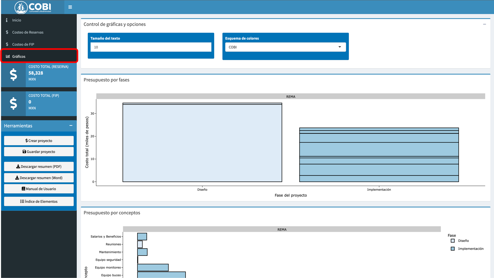

# Explorar el presupuesto {#explorar}

En el capítulo anterior vimos cómo llenar los datos. Aquí cubriremos cómo explorar las visualizaciones dentro de la app. Supongamos que ya llenamos toda la información necesaria , como lo hicimos en los ejemplos de REMA y FIP (Secciones \@ref(rema) y \@ref(fip)). Por lo tanto, la palicación se ve como la Figura \@ref(fig:exp-1).

**Paso 1 - ** Llena los datos como lo hicimos en el capítulo anterior (Fig \@ref(fig:exp-1)).

```{r exp-1, echo = F, fig.cap = "Llena el formato."}
knitr::include_graphics("images/exp-1.png")
```

**Paso 2 - ** Para explorar el presupuesto, haz click en la sección "Gráficos" en el panel lateral (Fig \@ref(fig:exp-2)). Esto te llevará al área de trabajo de exploración. El primer panel te permite controlar el tamaño del texto en las gráficas y cambiar el esquema de colores. El segundo te permite ver el presupuesto por fases. En este caso solamente tenemos datos para la fase de implementación, pero un presupuesto completo tendría 3 columnas (diseño, implementación y seguimiento). Los colores corresponden a los diferentes conceptos. Un "concepto" responde a la pregunta: ¿En qué estamos gatando el dinero?

```{r exp-2, echo = F, fig.cap = "Navega a la sección de gráficos."}

```

**Paso 3 - ** Explora las gráficas con tu cursor. Al nevegar sobre los diferentes colores, puedes ver ventanas con información (Fig \@ref(fig:exp-3)). Por ejemplo, podemos ver que más de la mitad del presupuesto está destinado al concepto de "Viajes y salidas a campo".

```{r exp-3, echo = F, fig.cap = "Explora los costos for fase."}
knitr::include_graphics("images/exp-3.png")
```

**Paso 4 - ** La segunda figura te muestra el resupuesto por conceptos (en el eje vertical) y el color está dado por las fases. La tercer figura te permite evaluar las asignaciones de responsabilidad financiera de los diferentes actores financieros (Fig \@ref(fig:exp-4)).

```{r exp-4, echo = F, fig.cap = "Otras gráficas."}

```
