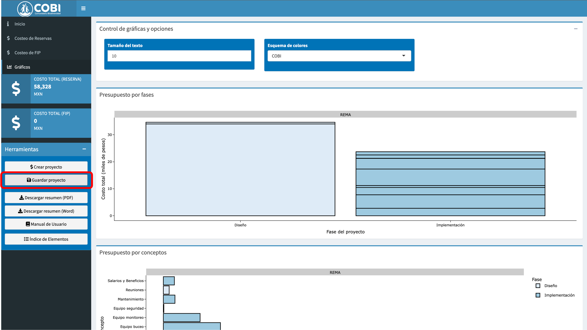
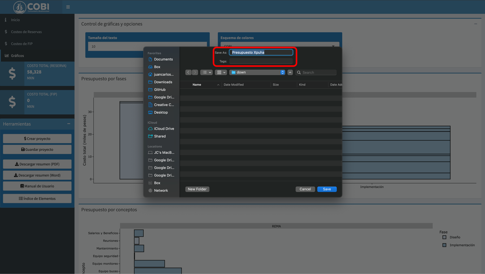

# Guardar el progreso de un presupuesto {#guardar}

Una vez que llenaste y exploraste el presupuesto, puedes descargar una hoja de Excel con todos sus contenidos. Esto puede ser útil para compartir el presupuesto con alguien, o para guardar tu progreso si planeas terminar el presupuesto en otro momento.

Para descargar el presupuesto, simplemente haz click en el botón de "Descargar presupuesto" en el planel lateral izquierdo (Fig \@ref(fig:down-1)).

```{r down-1, echo = F, fig.cap = "Botón para descargar."}

```

Dependiendo de las opciones de tu explorador, el archivo se va a descargar a tu folder de descargas, o un explorador se abrirá para permitirte elegir un lugar para descargar los datos y asignar un nombre al archivo (Fig \@ref(fig:down-2)). **NOTA IMPRTANTE: Si planeas re-utilizar este presupuesto para continuar modificaciones, es importante NO modificar manualmente los contenidos.**

```{r down-2, echo = F, fig.cap = "Ventana de descarga."}

```


