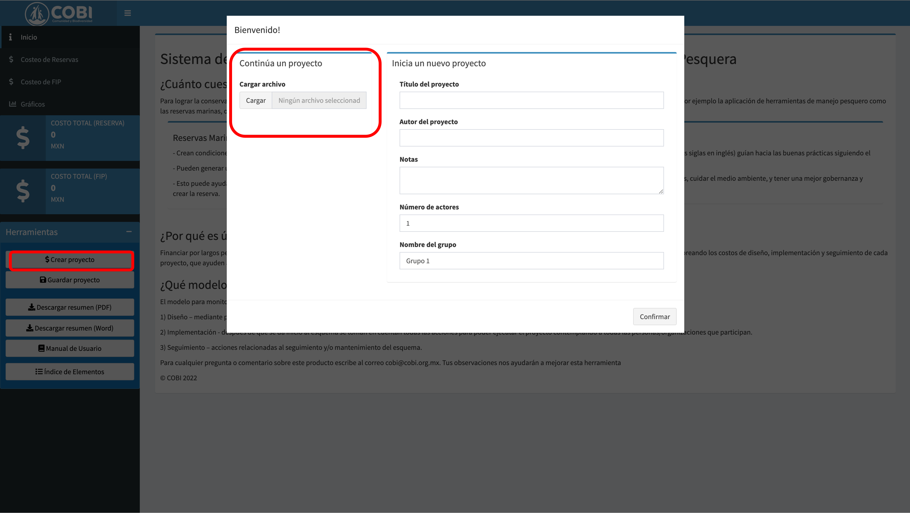
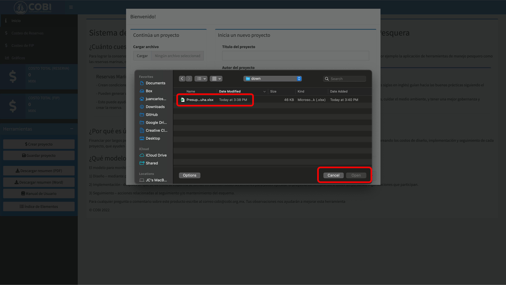
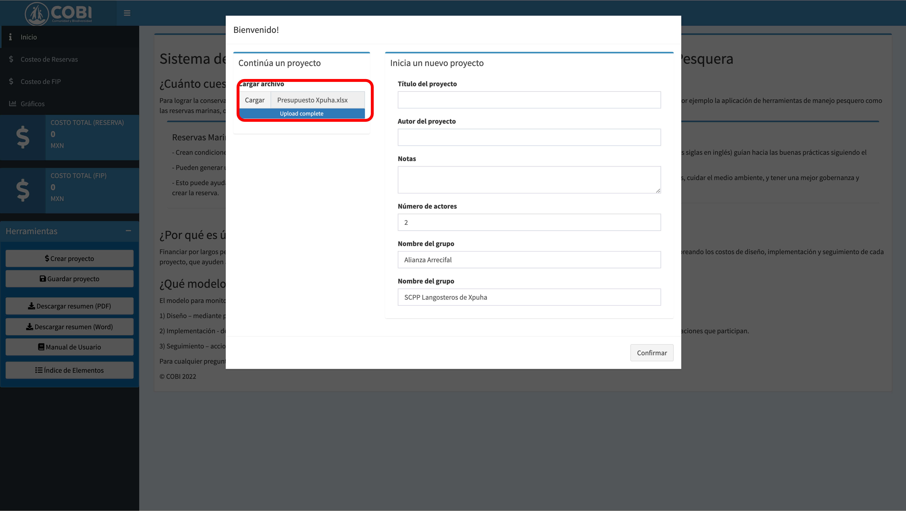
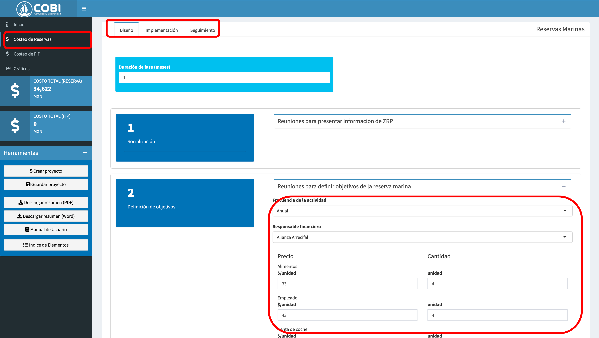

# Cargar el estado de un presupuesto anterior {#cargar}

La nueva versión de la app te permite cargar un archivo de presupuesto para automáticamente llenar los campos de la app. Esto puede ser útil si trabajarás varios días en la elaboración de un presupuesto y necesitas hacerlo en varias sesiones. También puede ser útil si tu organización desea elaborar un formato predeterminado de costos y cantidades para ciertas actividades.


**Paso 1 - ** Para cargar un presupuesto, empeiza con una sesión nueva donde todos los campos estén vacíos. En el panel lateral izquierdo, haz click n el botón de "Cargar" \@ref(fig:up-1)).

```{r up-1, echo = F, fig.cap = "Empieza con una sesión nueva."}

```


**Paso 2 - ** Selecciona el archivo de presupuesto que deseas cargar \@ref(fig:up-2)). En este ejemplo, estoy seleccionando un presupuesto de FIP, que se enfoca en la fase de implementación de una evaluación del estado del recurso.

```{r up-2, echo = F, fig.cap = "Asignar presupuesto a actores."}

```

**Paso 3 - ** Confirma ue el archivo fue cargado en el panel lateral \@ref(fig:up-3)).

```{r up-3, echo = F, fig.cap = "Asignar presupuesto a actores."}

```

**Paso 4 - ** Navega a la sección de FIP, fase de implementaión y selecciona las intervenciones correspondientes \@ref(fig:up-4)). Los elementos se poblarán automáticamente con los valores que cargaste. Ahora puedes continuar editando tu progreso. Cuando hayas terminado o necesites un descanso, simplemente descarga la versión actualizada de tu presupuesto como lo vimos en el capítulo anterior.

```{r up-4, echo = F, fig.cap = "Asignar presupuesto a actores."}

```
